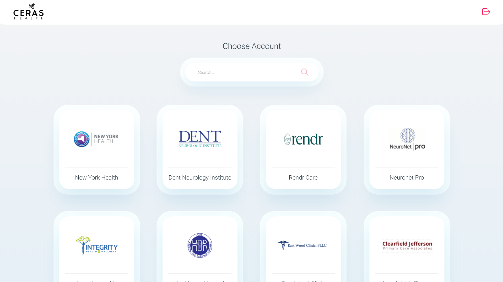
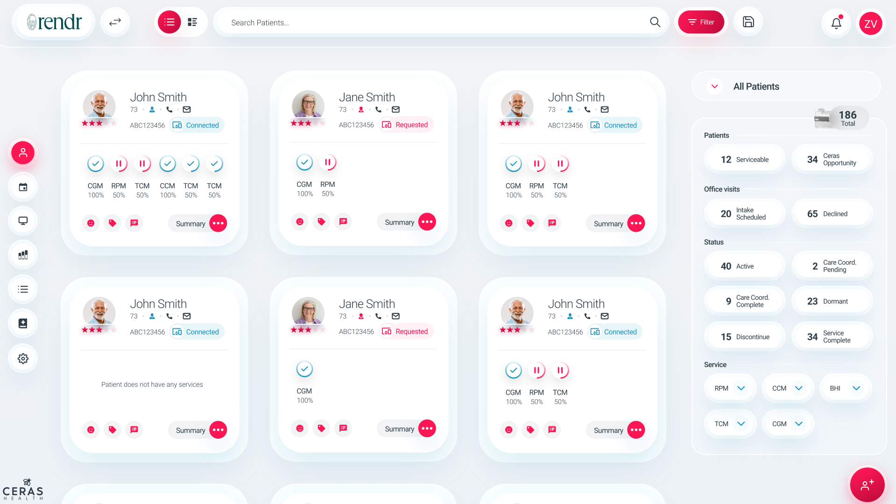
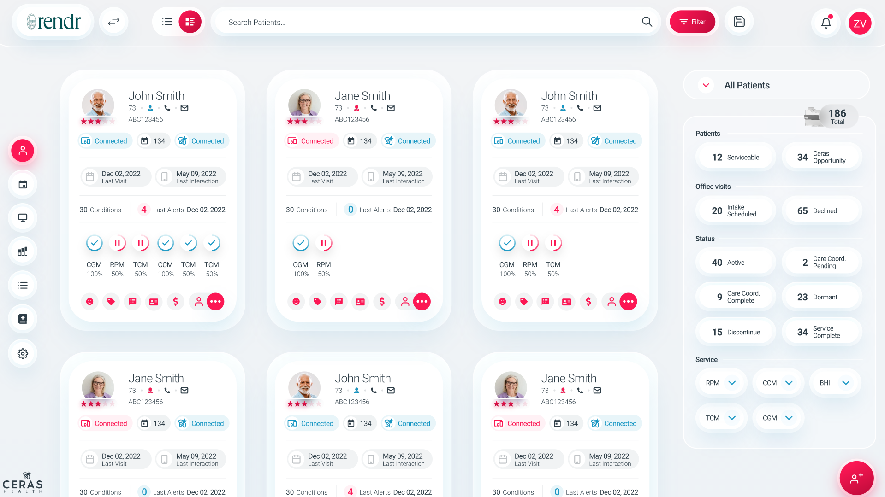
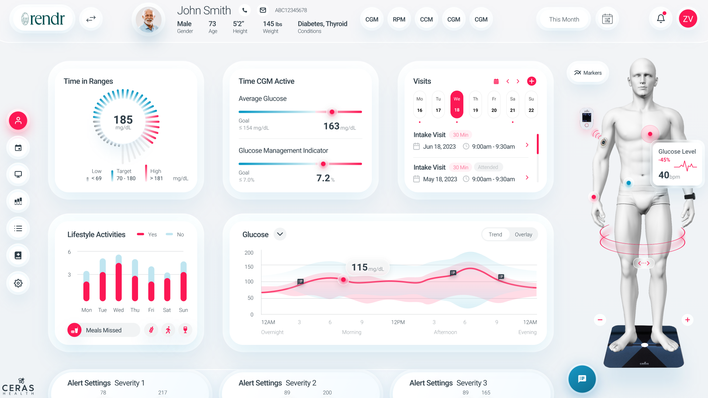

## Ceras Health

`04.2023 ~ 10.2023`

- As the lead developer of the Ceras Health Hospital Management System, I spearheaded a team of four developers, implementing a robust and efficient system utilizing Angular 17 for the frontend and Django for the backend. Embracing the principles of Agile methodology, our team ensured a streamlined and iterative development process, achieving milestones with precision and efficiency.

- Implemented Angular 17 for the frontend, employing Domain-Driven Design (DDD) patterns to ensure a scalable and maintainable codebase.

- Customized Angular Material Design for a polished and user-friendly interface, enhancing the overall user experience based on Adobe Design.

- Successfully navigated and resolved intricate challenges, particularly in adapting to and maximizing the potential of Angular 17's new signal feature.

- Developed a complementary mobile application for the Ceras Health Hospital Management System using Flutter, ensuring seamless accessibility and user engagement across various platforms.

- Took charge of designing and constructing the data structures for the Django backend, ensuring optimal performance and data integrity.

- Held responsibility for the implementation of robust patient and doctor management systems, contributing to the overall efficiency of the healthcare management solution

#### Category

`Angular` `Frontend` `DDD` `Nx` `Health`

|         Technology          |    Client     |
| :-------------------------: | :-----------: |
| Angular 17, DDD Pattern, Nx | United States |

| App | Link |
| :-: | :--: |

|             Images             |
| :----------------------------: |
|  |
|  |
|  |
|  |
